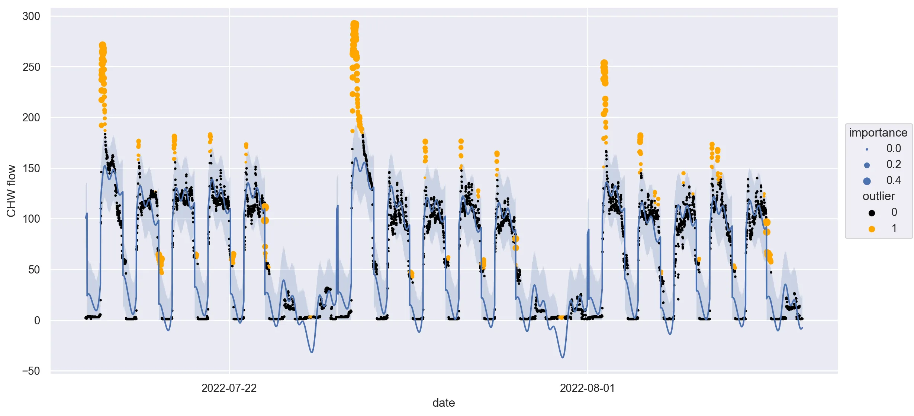

## Selected projects in data science, machine learning, and open source software development

### Onboard Data Science Tutorials \[[git](https://github.com/onboard-data/notebooks), [medium](https://medium.com/@christopher_DT)\]

A series of data science tutorials and open source evangelism for Onboard Data, Inc. Topics included tutorials on the company's API and API client \[[one](https://colab.research.google.com/github/onboard-data/notebooks/blob/dev/01_api_and_wrapper.ipynb), [two](https://colab.research.google.com/github/onboard-data/notebooks/blob/dev/02_data-points-exploration-in-pandas.ipynb), [three](https://colab.research.google.com/github/onboard-data/notebooks/blob/dev/03_time-series-analysis.ipynb)\], timeseries cleaning and basic imputation techniques \[[colab](https://colab.research.google.com/github/onboard-data/notebooks/blob/dev/04_timeseries_cleaning_and_imputation.ipynb), [medium](https://medium.com/onboard-blog/timeseries-cleaning-and-imputation-a96ab7e45eb7)\], feature engineering and selection \[[colab](https://colab.research.google.com/github/onboard-data/notebooks/blob/dev/05_Forecasting_part_1.ipynb), [medium](https://medium.com/onboard-blog/feature-selection-and-timeseries-forecasting-24067e0038e3)\], timeseries forecasting with Facebook's Prophet \[[colab](https://colab.research.google.com/github/onboard-data/notebooks/blob/dev/06_Forecasting_Part_2.ipynb), [medium](https://medium.com/onboard-blog/timeseries-forecasting-for-building-experts-part-2-trend-forecasting-ef82f594bc28)\], outlier and anomaly detection \[[colab](https://colab.research.google.com/github/onboard-data/notebooks/blob/dev/07_outliers_and_anomalies.ipynb), [medium](https://medium.com/onboard-blog/outlier-and-anomaly-detection-for-building-experts-8329492783ec)\], and fault detection in HVAC systems \[[medium](https://medium.com/onboard-blog/open-fdd-for-automated-hvac-fault-detection-209945efde57)\].

---

### Software Projects

[QuantAQ R Client](https://github.com/christopherDT/r-quantaq)
* Developing company's R API client from scratch following CRAN standards.

[Onboard R Client](https://github.com/onboard-data/client-R)

* Refined the company's internal R client, bringing it up to CRAN standards, making it ready to be public-facing. Improved parity with company's public-facing Python API client.

[Onboard ReadTheDocs](https://onboard-api-wrappers-documentation.readthedocs.io/en/latest/index.html)

* Updated the company's API client docs to reflect the newly-public R client.

[open-fdd](https://github.com/bbartling/open-fdd/)

* Overhauled one portion of this open source AHU fault detection. Reduced redundant code, shifted to OOP, improved modularization.

<!-- ---

### Category Name 2

- [Project 1 Title](http://example.com/)
- [Project 2 Title](http://example.com/)
- [Project 3 Title](http://example.com/)
- [Project 4 Title](http://example.com/)
- [Project 5 Title](http://example.com/)

--- -->