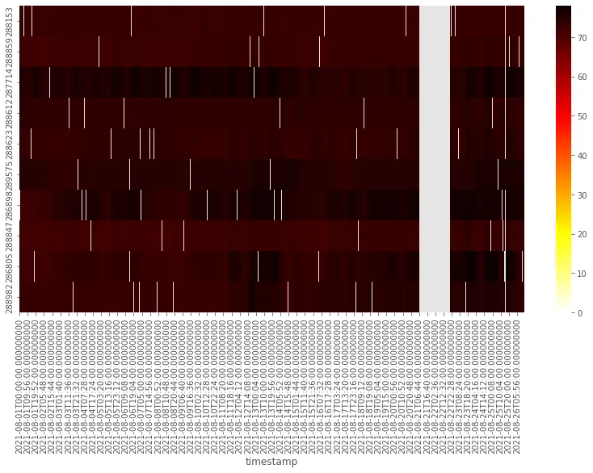
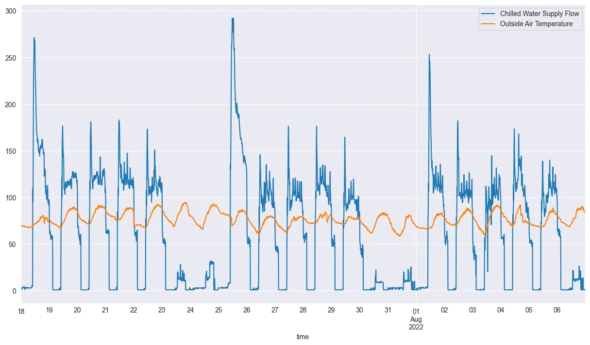
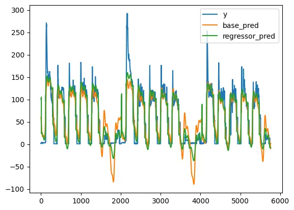

## Portfolio

### Onboard Data Science Tutorials \[[git](https://github.com/onboard-data/notebooks), [medium](https://medium.com/@christopher_DT)\]

Onboard API Tutorials \[[one](https://colab.research.google.com/github/onboard-data/notebooks/blob/dev/01_api_and_wrapper.ipynb), [two](https://colab.research.google.com/github/onboard-data/notebooks/blob/dev/02_data-points-exploration-in-pandas.ipynb), [three](https://colab.research.google.com/github/onboard-data/notebooks/blob/dev/03_time-series-analysis.ipynb)\]

Timeseries Cleaning and Imputation |  | [medium](https://medium.com/onboard-blog/timeseries-cleaning-and-imputation-a96ab7e45eb7)\]
<!--  -->

Forecasting, Part 1: Feature Selection \[[colab](https://colab.research.google.com/github/onboard-data/notebooks/blob/dev/05_Forecasting_part_1.ipynb) | [medium](https://medium.com/onboard-blog/feature-selection-and-timeseries-forecasting-24067e0038e3)\]
<!--  -->

Forecasting, Part 2: Trend Forecasting \[[colab](https://colab.research.google.com/github/onboard-data/notebooks/blob/dev/06_Forecasting_Part_2.ipynb) | [medium](https://medium.com/onboard-blog/timeseries-forecasting-for-building-experts-part-2-trend-forecasting-ef82f594bc28)\]
<!--  -->

Outlier and Anomaly Detection \[[colab](https://colab.research.google.com/github/onboard-data/notebooks/blob/dev/07_outliers_and_anomalies.ipynb) | [medium](https://medium.com/onboard-blog/outlier-and-anomaly-detection-for-building-experts-8329492783ec)\]
<!--  -->

Open Source Spotlight: open-fdd for HVAC fault detection \[[medium](https://medium.com/onboard-blog/open-fdd-for-automated-hvac-fault-detection-209945efde57)\]

<!-- open in colab icon: https://camo.githubusercontent.com/84f0493939e0c4de4e6dbe113251b4bfb5353e57134ffd9fcab6b8714514d4d1/68747470733a2f2f636f6c61622e72657365617263682e676f6f676c652e636f6d2f6173736574732f636f6c61622d62616467652e737667
 -->

---

### Projects

[Onboard R Client](https://github.com/onboard-data/client-R)

[Onboard ReadTheDocs](https://onboard-api-wrappers-documentation.readthedocs.io/en/latest/index.html)

[open-fdd](https://github.com/bbartling/open-fdd/)

---

### Category Name 2

- [Project 1 Title](http://example.com/)
- [Project 2 Title](http://example.com/)
- [Project 3 Title](http://example.com/)
- [Project 4 Title](http://example.com/)
- [Project 5 Title](http://example.com/)

---